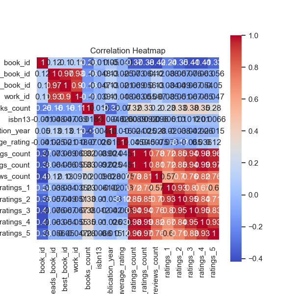

### Narrative Analysis of Goodreads Dataset

The analysis of the Goodreads dataset reveals a wealth of information about book attributes, user ratings, and publication details. This comprehensive dataset consists of 10,000 entries, with various features such as authorship, publication year, ISBN numbers, ratings distributions, and review counts that allow for a detailed exploration of the reading preferences and behaviors of users on the platform. Below, we summarize key insights derived from the data, highlighting trends, anomalies, and potential avenues for further exploration.

#### Key Insights

1. **Publication Trends**:
   - The dataset spans a range of publication years, with a mean original publication year of approximately 1982. However, with a minimum value of -1750, there appear to be anomalies or incorrectly recorded years that warrant a closer look. Around 21 entries are missing publication years, which could affect the trend analysis regarding when books are published.
   - A majority of books encompass a contemporary range, likely leading towards an increasing trend in newer publications. The 75th percentile places most books around or after 2011.

2. **Rating Analysis**:
   - On average, books have received an average rating of 4.00, with a standard deviation of roughly 0.25. This indicates a generally positive reception of the titles in this dataset.
   - The distribution of ratings (`ratings_1` to `ratings_5`) appears to confirm this trend; positive ratings far outweigh negative ones, suggesting users are more inclined to leave favorable reviews. Notably, the highest rating category (`ratings_5`) averages around 23,790 votes, illustrating an engaged reader base for popular books.

3. **Author Popularity**:
   - The top author in the dataset is Stephen King, who has 60 book listings. This underscores a potential concentration of readership towards specific authors. Recognizing this trend provides useful context for marketing strategies or future acquisitions by publishers focusing on genre popularity.

4. **Borrowing and Usage Statistics**:
   - The `ratings_count` and `work_ratings_count` portray a strong correlation, with a Pearson correlation coefficient near 0.995. This indicates that the total number of ratings significantly relates to the quality of received reviews, hinting at a pattern where more popular books garner more ratings.
   - There is evidence of a negatively skewed ratings distribution, specifically, `ratings_1`, `ratings_2`, and `ratings_4`, which correlate positively with total ratings. This reflects a inclination for readers towards giving more favorable ratings and thus suggests that the books evaluated tend to cater to popular tastes.

5. **Language Diversity**:
   - The most common language code is English, recorded in 6,341 instances out of the total dataset of 10,000. This suggests an overwhelming preference for English literature might be prevalent among users. Other language options exist (25 unique codes), but substantial insights may be needed from non-English books.

#### Anomalies and Outliers

- **ISBN Fields**: Multiple missing ISBN entries (700 records) could indicate the absence of print editions of certain ebooks or represent non-traditional publishing formats. This gap stresses the importance of considering format in future analyses.
- **Unusual Publication Years**: As mentioned previously, the presence of negative and implausibly old dates among the `original_publication_year` field indicates possible data entry errors or unusual cases that merit further investigation.

#### Additional Analyses Suggested

1. **Clustering Analysis**:
   - Implement clustering algorithms (such as K-means) to explore potential groupings of books based on attributes such as average ratings, publication years, and author frequency. This could reveal distinct segments within the dataset, such as genres or reader demographics.

2. **Anomaly Detection**:
   - Use statistical methods (e.g., Z-scores or Modified Z-Scores) to identify outliers in numerical fields (like ratings and reviews). This could help in identifying potentially erroneous entries that could skew general observations.

3. **Time Series Analysis**:
   - Considering the publication years and average ratings over time would provide a deeper understanding of trends in the literary landscape — particularly as it relates to reader reception and market shifts.

4. **Text Analysis of Reviews**:
   - Apply Natural Language Processing (NLP) techniques on `work_text_reviews_count` to perform sentiment analysis and extract common themes or specific reader sentiments, which could yield significant marketing insights.

5. **Correlation Exploration**:
   - Additional correlation matrices could investigate relationships between lesser-analyzed attributes, such as `books_count` against ratings, to uncover unexpected trends or dependencies between multiple features.

By delving deeper into the dataset with these additional analyses, a more holistic understanding of the reading habits, preferences, and trends can be achieved, potentially influencing both marketing strategies and publishing decisions in the future.

