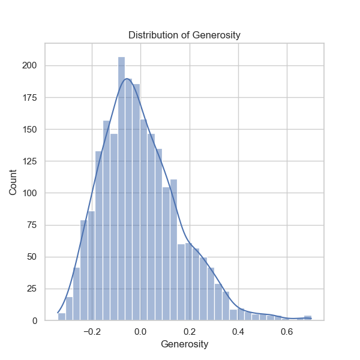

### Narrative Insights from Happiness Data Analysis

#### Overview
The dataset, 'happiness.csv', contains happiness-related data from various countries over the years, focusing on different factors such as GDP, social support, life expectancy, and perceptions of corruption. With 2,363 total data points from 165 unique countries, this dataset enables a comprehensive examination of factors influencing happiness across regions and time.

#### Key Findings

1. **Demographic Overview**
   - **Time Range**: The data spans from 2005 to 2023, with an average year of 2014.76. The data indicates consistent yearly data collection.
   - **Country Coverage**: The dataset predominantly features Lebanon (18 entries) but encompasses a wide array of countries, thereby allowing for comparative analyses.

2. **Distributions of Key Metrics**:
   - **Life Ladder**: The average score of 5.48 suggests moderate overall happiness, with values ranging from 1.281 (very low happiness) to 8.019 (very high happiness). The standard deviation (1.12) indicates significant variability in happiness across countries.
   - **Log GDP per capita**: With a mean of 9.40 (approx. $12,000), there is a positive correlation (0.78) between GDP and the Life Ladder. Outliers may exist at both ends: lower happiness scores with lower GDP per capita and vice versa.
   - **Social Support**: The average of 0.81 (on a scale where 1.0 is highest) suggests that social connections positively impact happiness. This metric has a strong correlation (0.72) with the Life Ladder.
   - **Negative and Positive Affect**: The average levels of positive (0.65) and negative affect (0.27) suggest that the population tends to report higher instances of positive emotions compared to the negative ones. However, there is a strong inverse correlation (-0.33) between them, showcasing that higher negative affect is associated with lower happiness levels.

3. **Correlation Analysis**:
   - **Freedom to Make Life Choices**: This metric has a notable correlation (0.54) with the Life Ladder, indicating that people's perceived freedom in decisions significantly influences happiness levels.
   - **Perceptions of Corruption**: Interestingly, high perceptions of corruption correlate negatively with the Life Ladder (-0.43), although it is less pronounced than other factors. It indicates that subjective views of governance impact overall life satisfaction.

4. **Missing Values Analysis**:
   - The dataset has several missing values, most notably in the ‘Healthy life expectancy at birth’ (63 missing), ‘Generosity’ (81 missing), and ‘Perceptions of corruption’ (125 missing). Handling these through imputation or removal of rows could influence correlation outcomes significantly.

#### Trends and Patterns
- The significant correlations between GDP per capita, social support, and measures of wellbeing reinforce the notion that economic factors and social ties play a pivotal role in promoting happiness.
- The data highlights the adverse impact of corruption and negative emotions on happiness levels.
- Given the spread of happiness scores and the presence of correlations with economic and social measures, there are opportunities for longitudinal studies to gauge how these relationships evolve over the years.

#### Anomalies and Outliers
- Possible outliers might exist within countries like Lebanon, as it shows a high frequency in the dataset but varies significantly in happiness scores. Observations of extreme values in GDP or social support may skew overall perceptions and normative measures of happiness in this dataset.
- Countries with low GDP yet high happiness might require deep dives (e.g., Bhutan with its focus on Gross National Happiness).

#### Additional Analyses Suggestions
1. **Clustering Analysis**: 
   - Using methods like K-Means or Hierarchical clustering could help identify groups of countries with similar happiness levels and their associated predictors. This might reveal hidden patterns or segments that share unique attributes influencing their wellbeing.

2. **Time Series Analysis**:
   - Investigating trends over time for specific countries could be insightful. Techniques like ARIMA could model changes in happiness metrics over the years.

3. **Anomaly Detection**: 
   - Implementing machine learning models aimed at detecting outliers could flag countries that diverge from their peer group trends significantly concerning happiness metrics.

4. **Comparative Analysis**:
   - Further comparisons could be made between countries classified by income levels or governance indices, enriching understanding of the global happiness landscape.

5. **Regression Models**: 
   - Employ multiple regression analysis to quantify the contribution of various factors on the happiness index, allowing better understanding of impact sizes.

### Conclusion
The analysis of 'happiness.csv' reveals vital insights into the determinants of happiness across countries, emphasizing social support and economic factors while calling attention to the negative influence of corruption. By employing additional advanced analyses, one can further deep dive into the complexities of happiness, illuminating diverse paths toward improving it globally.

