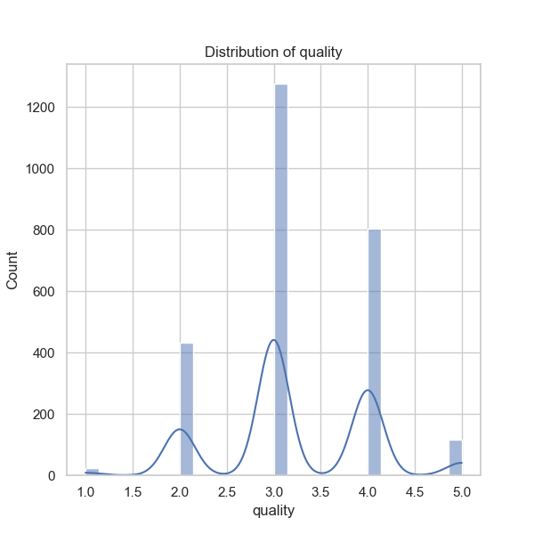

### Analysis Narrative of Data from 'media.csv'

#### Overview
The dataset 'media.csv' comprises records related to various media items, with a total of 2,652 entries. Key features include metadata such as `date`, `language`, `type`, `title`, and `author (by)`, along with user-generated metrics like `overall rating`, `quality`, and `repeatability`. This analysis will summarize the key findings, explore trends, and suggest additional analyses for deeper insights.

#### Summary of Findings

1. **Date Analysis**: 
   - The dataset includes records spanning various dates, with a total of 2,055 unique unique dates. The most frequent entry is '21-May-06', which appears 8 times, suggesting that there may be specific periods with heightened activity or a repeated submission of content.
   - However, there are 99 missing values in the `date` column. It would be prudent to investigate if these missing dates correspond to certain types of media or timeframes.

2. **Language Distribution**: 
   - English is the predominant language, appearing in over 49% of the entries (1,306 entries). The dataset contains media in 11 different languages, which could indicate a diverse range of media from various cultural backgrounds. It may be useful to look more closely at the distribution of ratings across languages.

3. **Type of Media**: 
   - The majority of the entries (approximately 83%) are classified as 'movies', which suggests that the dataset likely focuses on film media. This concentration might overshadow other media types such as 'TV shows', 'DVDs', etc., which could have different patterns in ratings and user engagement.

4. **Title Analysis**:
   - There are 2,312 unique titles, indicating a wide variety of media content. 'Kanda Naal Mudhal' ranks as the most frequently mentioned title, listed 9 times, but this could also signal a few titles being disproportionately represented in the dataset.

5. **Authorship Insights**:
   - The `by` column has recorded 2,528 unique contributors, with Kiefer Sutherland being the most frequently noted contributor (48 entries). This high frequency could imply a significant interest in works associated with this individual. With 262 missing values in the `by` column, further analysis could help determine if certain types of media are more commonly reviewed or rated without attribution.

6. **Rating Metrics**:
   - Ratings for `overall`, `quality`, and `repeatability` present interesting insights:
     - **Overall**: The mean rating is about 3.05 (on a scale that likely ranges from 1 to 5), with minimal variation (std deviation of ~0.76), suggesting a general trend towards mid-range ratings.
     - **Quality**: The mean rating is higher at approximately 3.21, indicating that while overall ratings are average, perceived quality is slightly better.
     - **Repeatability**: The lowest mean at ~1.49 suggests that the likelihood of users wanting to engage with the same media multiple times is relatively low.

7. **Correlations**:
   - A strong correlation (0.83) exists between `overall` ratings and `quality`, indicating that higher quality perceptions lead to better overall ratings. The correlation between `overall` and `repeatability` is moderate (0.51), suggesting that higher-rated media may attract repeat views, but to a lesser extent.

#### Insights & Trends:
- **General Sentiment Analysis**: The overall average ratings hover around 3, signaling that while users are generally not dissatisfied, there is room for improvement in quality.
- **Cultural Diversity**: The blend of languages indicates potential for varied cultural representation; however, majorities such as English and media types like `movie` could skew insights.
- **Influence of Author**: Given the notable entries by particular authors, deeper analysis into how contributions influence ratings could reveal authorial trends.
  
#### Suggested Additional Analyses:
1. **Time Series Analysis**: Investigate trends over time for ratings and submissions to detect any patterns in popularity or quality over the years.
2. **Clustering**: Implement clustering algorithms (e.g., K-means) to categorize media based on their attributes (ratings, type, language) to identify which groups exhibit similar characteristics.
3. **Anomaly Detection**: Use statistical methods or machine learning techniques to detect outlier entries in ratings and repeatability that deviate from the expected other than those noted.
4. **Comparative Analysis by Language/Type**: Conduct analyses comparing the mean and median ratings across different languages and types of media to see where disparities exist.

In summary, the 'media.csv' dataset reveals a rich tapestry of media representation, highlighting trends in ratings and the influence of language and authorship. Further analysis holds the potential to deepen insights and inform media curation strategies.

